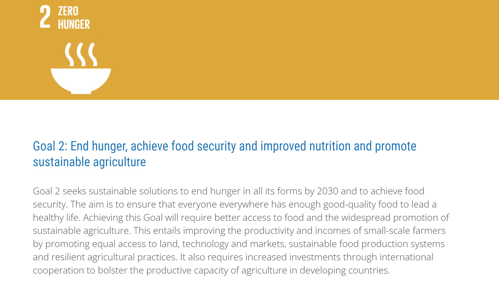

 # DH110-UX

## Zero Hunger Project 
### Victoria Delk in DH110 

I hope this project can spread awareness and concern for the large nmber of malnurished people worldwide. It's easy to get cought up in the bubble that is UCLA and forget about the food insucerties many face on a dirly basis. According to the United Nations the number of people who suffer from malnurishment and hunger has actually been increasing for the past 7 years, due to man made enviormental impact and climate change. If we were to stay on the trach we are currently on, by 2030 over 840 million people will be affected by hunger. I dont think this is a topic that gains the attention it deserves, so I hope this project can shed some light on the importance of solving this tragety. 

## My chosen sites

## https://unstats.un.org/sdgs/report/2016/goal-02/ from UN stats 

### Site Description
This website highlights the severity of food insecurity worldwide and backs up its claims with facts and figures. This statistical branch of the UN (UN stats) works to compile statistical data worldwide to advance the global statistical system and improve people's lives. The Particular article I have chosen is very thorough in its data analysis and includes information on a number of nations. It presents its data using numbers and charts and cites many scientific studies when making claims.  It explains how accomplishing the "Zero Hunger" goal will come with the improvement in sustainable agriculture, equal access to land and technology, and certain increased investments.

###Huristic Evalustion

## #1 Visibility of System Status
**Definition:** Users should be kept aware of the status of whatever they do on a site.   
**Evaluation:** This site does a good job at meeting his huristic.Each  button is correctly labled with the outcome of pressing it and loading signs are used approperatly.  
**Sevarity Rating:** 1

## #2 Match Between System and the Real World
**Definition:** Design with phrases, concepts, and flows already familiar to the user.   
**Evaluation:** This site does a good job at meeting this huristic. The scoll, chart layout, and buttons all function like expected to the user.  
**Sevarity Rating:** 1

## #3 User Control and Freedom
**Definition:** Easily allow Users to exit or undo tasks .  
**Evaluation:** This site makes it easy to undo poppping out a chart, this site does not allow you to "un download" a chart after pressing the button. For this Reason this huristoc is not met.  
**Sevarity Rating:** 2

## #4 Consistency and Standards
**Definition:** Make uniform design and concept decisions across the whole of your application   
**Evaluation:** This huristc is met. The site uses the exact same format for presenting their charts and descriptions throght the page. It also follows the same color scheme and font.  
**Sevarity Rating: ** 1

## #5 Error Prevention
**Definition:** Anticipate and prevent users' errors before they happen   
**Evaluation:** This huristic is met, the site is mostly static and makes it pretty hard for erros to be made on the users part.  
**Sevarity Rating:** 1

## #6 Recognition Rather Than Recall
**Definition:** Do not force users to memorize any information, instead, give it to them and let them recall it   
**Evaluation:** This huristic is not met, the page old lots of verbose numarical data and does not have a means to allow the users to reacll any.  
**Sevarity Rating:** 2

## #7 Flexibility and Efficiency of Use
**Definition:** Grant more experienced users shortcuts to speed up their uses   
**Evaluation:** This huristoc is not met, there is no shortcuts to scrolling or gathering information for more experiences users.  
**Sevarity Rating:** 2

## #8 Aesthetic and Minimalist Design
**Definition:** Only contain relevant and necessary information   
**Evaluation:** This huristic is not met. The design seems convoluted with a surplus of large text going with each diagram.  
**Sevarity Rating:** 3

## #9 Help Users Recognize, Diagnose, and Recover From Errors
**Definition:** Use clear and concise error messages   
**Evaluation:** This huristic is not met, the site doesn not aid in error recovary, leaving that burden to the user.  
**Sevarity Rating:** 2

## #10 Help and Documentation
**Definition:** Provide documentation users may follow to complete their task    
**Evaluation:** This huristic is not met, the page meerly provides informatio, but does not provide resoures as how to obtain it.  
**Sevarity Rating:** 2

##Overall Evaluation
Overall, I felt this website did a good job of providing the necessary statistics for the Zero Hunger SUstainable goal. I found the charts to be extremely useful for visualizing the information. However, I found the information to be a little dense and quite statistical. For this reason, I think this website of best for someone already focused on this sustainable goal rather than someone new to learn about food insecurity. Overall, I would rate this website an 8/10 because it has a lot of very useful information conveyed in a pretty good way, I just think it could cater to a broader audience.

### https://www.jointsdgfund.org/sustainable-development-goals/goal-2-zero-hunger from Joint SDG Fund 

### Site Description

###Huristic Evalustion

## #1 Visibility of System Status
**Definition:** Users should be kept aware of the status of whatever they do on a site.   
**Evaluation:**
**Sevarity Rating:** 

## #2 Match Between System and the Real World
**Definition:** Design with phrases, concepts, and flows already familiar to the user.   
**Evaluation:** 
**Sevarity Rating:** 

## #3 User Control and Freedom
**Definition:** Easily allow Users to exit or undo tasks   
**Evaluation:** 
**Sevarity Rating:** 

## #4 Consistency and Standards
**Definition:** Make uniform design and concept decisions across the whole of your application   
**Evaluation:** 
**Sevarity Rating:** 

## #5 Error Prevention
**Definition:** Anticipate and prevent users' errors before they happen   
**Evaluation:** 
**Sevarity Rating:** 

## #6 Recognition Rather Than Recall
**Definition:** Do not force users to memorize any information, instead, give it to them and let them recall it   
**Evaluation:** 
**Sevarity Rating:** 

## #7 Flexibility and Efficiency of Use
**Definition:** Grant more experienced users shortcuts t speed up their uses   
**Evaluation:** 
**Sevarity Rating:** 

## #8 Aesthetic and Minimalist Design
**Definition:** Only contain relevant and necessary information   
**Evaluation:** 
**Sevarity Rating:** 

## #9 Help Users Recognize, Diagnose, and Recover From Errors
**Definition:** : Use clear and concise error messages   
**Evaluation:**
**Sevarity Rating:**

## #10 Help and Documentation
Sevarity Rating:  Provide documentation users may follow to complete their task    
**Evaluation:** 
**Sevarity Rating: 

##Overall Evaluation
