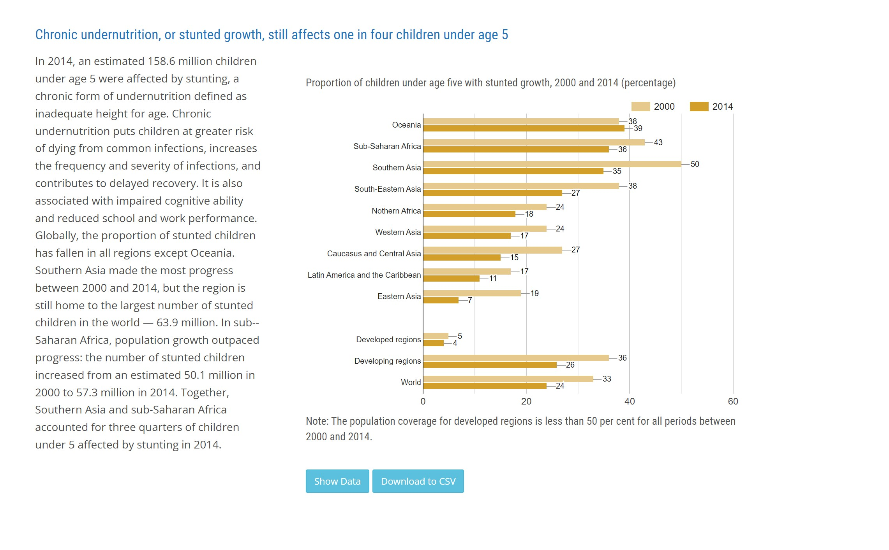
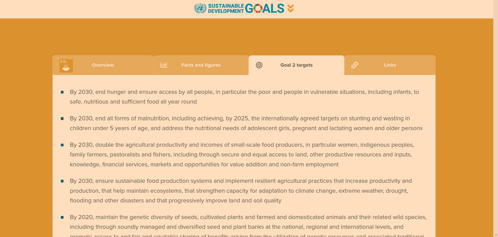
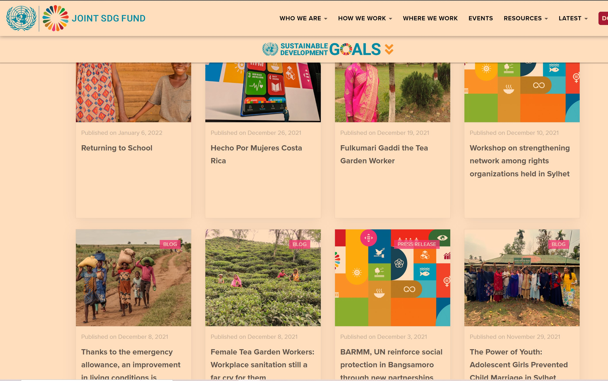

 # DH110-UX

## Zero Hunger Project 
### Victoria Delk in DH110 

I hope this project can spread awareness and concern for the large nmber of malnourished people worldwide. It's easy to get cught up in the bubble that is UCLA and forget about the food insecurties many face on a daily basis. According to the United Nations, the number of people who suffer from malnourishment and hunger has actually been increasing for the past 7 years, due to manmade environmental impact and climate change. If we were to stay on the track we are currently on, by 2030, over 840 million people will be affected by hunger. I dont think this is a topic that gains the attention it deserves, so I hope this project can shed some light on the importance of solving this tragedy. 

## Site 1

## https://unstats.un.org/sdgs/report/2016/goal-02/ from UN stats 

## Site Description
This website highlights the severity of food insecurity worldwide and backs up its claims with facts and figures. This statistical branch of the UN (UN stats) works to compile statistical data worldwide to advance the global statistical system and improve people's lives. The particular article I have chosen is very thorough in its data analysis and includes information on a number of nations. It presents its data using numbers and charts and cites many scientific studies when making claims.  It explains how accomplishing the "Zero Hunger" goal will come with the improvement in sustainable agriculture, equal access to land and technology, and certain increased investments.

## Heuristic Evalustion

### #1 Visibility of System Status
**Definition:** Users should be kept aware of the status of whatever they do on a site.   
**Evaluation:** This site does a good job at meeting his heuristic. Each button is correctly labeled with the outcome of pressing it and loading signs are used appropriately.  
**Sevarity Rating:** 1

### #2 Match Between System and the Real World
**Definition:** Design with phrases, concepts, and flows already familiar to the user.   
**Evaluation:** This site does a good job at meeting this heuristic. The scoll, chart layout, and buttons all function like expected to the user.  
**Sevarity Rating:** 1

### #3 User Control and Freedom
**Definition:** Easily allow users to exit or undo tasks.  
**Evaluation:** This site makes it easy to undo poppping out a chart, this site does not allow you to "undownload" a chart after pressing the button. For this reason, this heuristic is not met.  
**Sevarity Rating:** 2

### #4 Consistency and Standards
**Definition:** Make uniform design and concept decisions across the whole of your application.  
**Evaluation:** This heuristic is met. The site uses the exact same format for presenting their charts and descriptions throughout the page. It also follows the same color scheme and font.  
**Sevarity Rating: ** 1

### #5 Error Prevention
**Definition:** Anticipate and prevent users' errors before they happen.   
**Evaluation:** This heuristic is met, the site is mostly static and makes it pretty hard for errors to be made on the user's part.  
**Sevarity Rating:** 1

### #6 Recognition Rather Than Recall
**Definition:** Do not force users to memorize any information, instead, give it to them and let them recall it.   
**Evaluation:** This heuristic is not met, the page uses lots of verbose numerical data and does not have a means to allow the users to recall any.  
**Sevarity Rating:** 2

### #7 Flexibility and Efficiency of Use
**Definition:** Grant more experienced users shortcuts to speed up their uses.   
**Evaluation:** This heuristic is not met, there is no shortcuts to scrolling or gathering information for more experienced users.  
**Sevarity Rating:** 2

### #8 Aesthetic and Minimalist Design
**Definition:** Only contain relevant and necessary information.   
**Evaluation:** This heuristic is not met. The design seems convoluted with a surplus of large text going with each diagram.  
**Sevarity Rating:** 3

### #9 Help Users Recognize, Diagnose, and Recover From Errors
**Definition:** Use clear and concise error messages.   
**Evaluation:** This heuristic is not met, the site does not aid in error recovary, leaving that burden to the user.  
**Sevarity Rating:** 2

### #10 Help and Documentation
**Definition:** Provide documentation users may follow to complete their task.   
**Evaluation:** This heuristic is not met, the page merely provides information, but does not provide resoures as how to obtain it.  
**Sevarity Rating:** 2

##Overall Evaluation
Overall, I felt this website did a good job of providing the necessary statistics for the Zero Hunger SUstainable goal. I found the charts to be extremely useful for visualizing the information. However, I found the information to be a little dense and quite statistical. For this reason, I think this website of best for someone already focused on this sustainable goal rather than someone new to learn about food insecurity. Overall, I would rate this website an 8/10 because it has a lot of very useful information conveyed in a pretty good way, I just think it could cater to a broader audience.

## Site 2
### https://www.jointsdgfund.org/sustainable-development-goals/goal-2-zero-hunger from Joint SDG Fund 

## Site Description

Similarly, this website highlights the severity of food insecurity worldwide and backs up its claims with facts and figures. The Sustainable Development Goals (SDG) Fund works to accelerate the meeting of the Zero Hunger goal (along with the other ssustainable development goals). It provides an overview of the goal, facts and figures, the goal's targets, as well as many relevant links. However, the majority of the page (when you scroll downward) is fully linked to related articles that may contribute to the Zero Hunger goal, each article is linked by a picture and its title. 

## Heuristic Evalustion

### #1 Visibility of System Status
**Definition:** Users should be kept aware of the status of whatever they do on a site.   
**Evaluation:** This heuristic is met as all buttons and links are very explicitly labeled 
**Sevarity Rating:** 1

### #2 Match Between System and the Real World
**Definition:** Design with phrases, concepts, and flows already familiar to the user.   
**Evaluation:** This is met because the selection table that allows users to select what information to view seems very familar and intuitive to use. 
**Sevarity Rating:** 1

### #3 User Control and Freedom
**Definition:** Easily allow users to exit or undo tasks   
**Evaluation:** This heuristic is not met because when a user errors (i.e., clicks on a link by mistake) it's not very easy to undo it. The user must wait until they can go back, and when they use the "back arrow" to do so, the user is not brought to the same place they were.
**Sevarity Rating:** 3

### #4 Consistency and Standards
**Definition:** Make uniform design and concept decisions across the whole of your application.   
**Evaluation:** This heuristic is not met. The top half of the page is very dull with mostly text while the articles linked at the bottom are very colorful and bright. 
**Sevarity Rating:** 2

### #5 Error Prevention
**Definition:** Anticipate and prevent users' errors before they happen.   
**Evaluation:** This heuristic is not met, if the user accidentally makes an error they must suffer the consequences. The site does not have any built in safety mechanisims. 
**Sevarity Rating:** 2

### #6 Recognition Rather Than Recall
**Definition:** Do not force users to memorize any information, instead, give it to them and let them recall it.   
**Evaluation:**  This heuristic is not met, the page uses lots of verbose numerical data and does not have a means to allow the users to recall any.  
**Sevarity Rating:** 2

### #7 Flexibility and Efficiency of Use
**Definition:** Grant more experienced users shortcuts to speed up their uses.   
**Evaluation:** This heuristic is not met, every user, no matter how advanced, must go through the same experience without being able to speed up the process. 
**Sevarity Rating:** 2

### #8 Aesthetic and Minimalist Design
**Definition:** Only contain relevant and necessary information.   
**Evaluation:** This heuristic is not met, the page is very convoluted with irrelevant links and articles making it hard for the user to focus. 
**Sevarity Rating:** 3

### #9 Help Users Recognize, Diagnose, and Recover From Errors
**Definition:** Use clear and concise error messages.   
**Evaluation:** This heuristic is not met, the site does not aid in error recovery, leaving that burden to the user.  
**Sevarity Rating:** 2

### #10 Help and Documentation
**Definition:** Provide documentation users may follow to complete their task.    
**Evaluation:** This heuristic is not met, there does not exist any documentation for the users to follow. 
**Sevarity Rating:** 2

##Overall Evaluation
Overall, I felt this website did a decent job of providing awareness on the Zero hunger sustainable develepment goal. However, I found the webpage to fail to meet a number of the 10 heuristics. I think the data was presented in a very dense way that made it difficult to viusalize and understand on a large scale. Also I found the numerous links on the bottom on the page to be distracting and unhelpful. Overall, I would rate this website a 6/10 because it has a lot of very useful information but is not conveyed in the best way.
